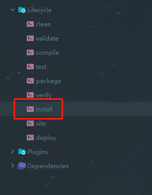
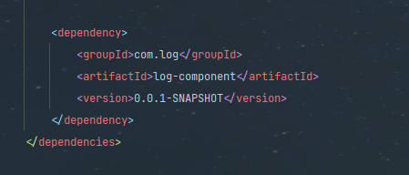
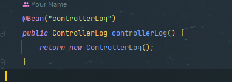

# springboot-aop-log
springboot使用aop实现日志管理

# 使用方法
可以使用一下两种方法将组件导入到项目当中

1. 直接将代码复制到自己的项目当中，但是不推荐，此处不做详细介绍
2. 推荐方法：

将项目clone到本地之后执行maven的install，而后在项目中有引入相关依赖即可

- install

- 导入依赖

- 配置日志相关bean

至此，日志组件配置完成

